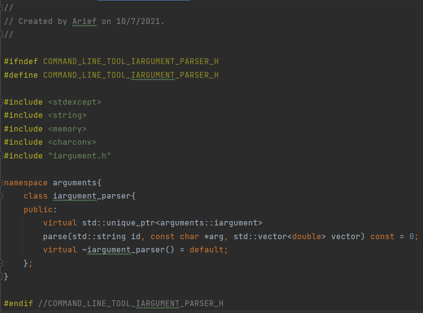

# Advanced Programming Concepts, assignment 1

## Introduction
In this document, the program is elaborated. This document highlights the choices and changes made to the initial code given.
This document is seperated in sections respective to the different major entities of the program. The program flow does not
necessarily follow the structure of this document. The implementation of the program is referenced heavily from the tutorial
given by the module teacher.

## Arguments
The basis of this program revolves around program arguments which are given by the user using the terminal.

In short, arguments consist of a value of some type. Each argument is correlated to a specific option. An argument does
not exist in the absence of an option. The type of value that an argument stores is versatile.

To implement arguments, interfaces are used to provide versatile functionality for an argument to store different
variable types. This interface is named 'iargument.h' in the program. This interface provides the respective option or
flag name that is associated to this argument. The interface is shown below.

All concrete argument classes that implement the 'iargument.h' interface implements the 'id' function. An example of this
is shown below with the 'int_argument.h'.

## Argument parsers
Arguments store type-specific values. However, an argument is not capable of storing a value from the terminal arguments
without a parsing functionality. To handle this, a parse function is implemented to assign the
correct value to their respective argument. Although this is sufficient, in concept an argument's responsibility is to
store values of a specific type. It should not be responsible for parsing the terminal arguments. Therefore, an interface
is used to provide a general functionality of a parser.

Concrete argument parsers were used to handle one specific type of argument. An example of this is shown below with the
'int_argument_parser.h'

## Options
Options are the available command arguments implemented in the program. Arguments are associated with an option and can
only be handled if the option is available in the program. Hence, an option can handle one or more arguments. An option
should represent all the information required by the user which can consist of long and short flags, number of arguments
accepted and much more.

Initially, handling of options were performed by argument-specific options. This meant that multiple options were created
to handle its accepted argument. This was successful, however repetitive. Functionality of each option were similar and
at some almost identical. To compensate for this, a composite structure was implemented for the option class. This is
suitable as one option class is sufficient for storing and implementing all required functions and member variables.

The responsibility of the option class is to store member variables and to recognise if an option is a flag or an option.
All parsing functionality is passed to the respective argument-parser set for an option. Below is the 'option.h' class.

## Option parser
The argument parsing procedure begins with the option parser. The option parser will 'parse' through every argument
given to the program (from the command line or terminal). The responsibility of teh option parser is to search through
options implemented in the program and attempt to associate the argument with the correct option.

Implemented options are stored in a vector container which an option parser holds. The option parser 'parses' through
the vector container when searching the associated option for a given argument. If an option is capable to parse an
argument, the option parser will pass the 'parsing' responsibility to the option's respective argument-parser. Below is
the declaration of the option parser class.

## Parsing arguments in detail
In this section, the argument parsing procedure is explained in more detail. For this section, the initialisation of the
program is disregarded.

The argument parsing procedure revolves around the functionality of the option parser. For better readability, a numbered
point list is shown below:

### Option parser:

1) Start traversing the arguments (starting with the first character)
2) Check if the argument is a '--help' or '-h' flag (Help flag)
3) Go through each option by assigning 'opt'
4) Check if current option 'opt' can parse the current argument 'args' 
5) If argument is accepted by the option, pass arguments to the option argument-parser for parsing.
6) Once argument is parsed, perform book-keeping for the next argument.

Argument parsing is continued to the option class.

### Option:

1) Option takes the arguments from the option parser.
2) At this point, we have only parsed the flags of the option. Check if this is a flag or an ordinary option (3 for flag, 4 for ordinary option)
3) If this option is a flag (option that does not take any arguments) then pass the arguments to the argument-parser.
4) If this option is an ordinary option (option takes at least one argument) then increment to the next argument in the terminal.

Argument parsing is continued to the option parser

### Argument parser:

An example of an argument-parser is the 'int_argument_parser' above.

1) The arguments were passed into the argument parser.
2) Each specific argument parser can be different, please refer to the respective argument parser.

Argument parsing is continued to the argument

### Argument:

An example of an argument is the 'int_argument' above.

1) Value of the parsed argument is passed into the argument class.
2) Set the value of the argument with the passed argument.
3) Return the parsed argument back to the argument-parser

Argument parsing is continued back to the argument parser. From this section, the trace back to the option parser occurs.

## Creating an option parser using a builder

For readability, a builder is used to configure and create an option parser.

option_parser_builder.h

## Loggers and writers

The main program should not be responsible for printing. There should be an entity that is responsible for printing to
the console or any other platform. Therefore, an interface is created to create a general functionality of a 'logger'
and a 'writer'. This compensates the SRP concept, the implementation for these classes are shown below.

ilogger.h

console_logger.h

console_logger.cpp

console_writer.h

console_writer.cpp